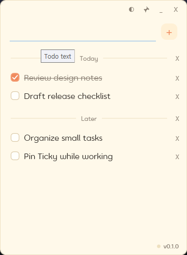

# Ticky

Ticky는 가볍게 띄워두고 쓰는 Windows용 미니 todo 앱입니다.

복잡한 프로젝트 관리 도구가 아니라, 지금 당장 해야 할 일을 화면 한쪽에 작게 고정해두고 빠르게 확인하기 위한 프로그램입니다. 메모장처럼 단순하게 열어두고, 할 일을 추가하고, 끝난 일은 체크하고, 필요 없는 항목은 바로 지울 수 있습니다.

## 이런 때 쓰기 좋습니다

- 작업 중 잠깐씩 확인해야 하는 체크리스트가 있을 때
- 회의, 기획, 개발, 디자인 작업 중 잊으면 안 되는 작은 할 일을 정리할 때
- 큰 todo 서비스나 캘린더까지 열 필요는 없지만 화면에 계속 띄워두고 싶을 때
- 게임, 문서, 브라우저, 작업 툴 위에 작은 목록을 올려두고 흐름을 유지하고 싶을 때

## 주요 기능

- todo 항목 추가, 체크, 체크 해제, 삭제
- 항목 드래그로 순서 변경
- 구분선 추가와 제목 설정
- 항상 위에 고정하는 핀 모드
- 배경이 비치도록 조절하는 투명도 설정
- Windows 시작 시 자동 실행
- 앱을 껐다 켜도 유지되는 todo 목록
- GitHub 릴리스를 통한 업데이트 확인

## 사용 방식

Ticky는 많은 기능을 넣기보다, 할 일 목록을 빠르게 적고 계속 볼 수 있게 하는 데 집중합니다. 창을 작게 줄여 화면 한쪽에 두거나, 핀 모드로 다른 창 위에 올려두고 사용할 수 있습니다.

항목을 체크하면 완료 표시와 취소선이 들어가고, 필요한 경우 항목을 드래그해서 우선순서를 바꿀 수 있습니다. 구분선을 이용하면 업무별, 사람별, 주제별로 목록을 나눠 정리할 수 있습니다.

## 사용법

- 항목 추가: 입력창에 할 일을 적고 `+` 버튼을 누르면 목록에 추가됩니다.
- 완료 체크: 항목 왼쪽의 체크박스를 누르면 완료 상태가 되고, 다시 누르면 해제됩니다. 완료된 항목에는 취소선이 표시됩니다.
- 항목 삭제: 각 항목 오른쪽의 `X`를 누르면 해당 항목이 삭제됩니다.
- 구분선 추가: 항목을 우클릭한 뒤 `구분선 추가`를 선택하면 목록에 구분선을 추가할 수 있습니다.
- 구분선 제목 설정: 구분선을 우클릭하면 제목 입력창이 열립니다. 제목을 비워두면 선만 표시됩니다.
- 순서 변경: todo 항목이나 구분선을 잡고 드래그하면 원하는 위치로 순서를 바꿀 수 있습니다.
- 핀 모드: 상단의 핀 아이콘을 누르면 Ticky가 다른 창 위에 계속 표시됩니다.
- 투명도 조절: 상단의 투명도 아이콘에 마우스를 올린 뒤 나타나는 슬라이더로 창 투명도를 조절할 수 있습니다.
- 업데이트: 우측 하단에 `업데이트 확인됨`이 표시되면 해당 문구를 클릭해 최신 버전으로 업데이트할 수 있습니다. 업데이트가 없을 때는 현재 버전이 표시됩니다.

## 후원

Ticky가 마음에 들었다면 Ko-fi에서 후원할 수 있습니다.

[https://ko-fi.com/pixelhoon](https://ko-fi.com/pixelhoon)

---

# Ticky

Ticky is a lightweight mini todo app for Windows.

It is not meant to replace a full project management tool. Ticky is designed for quick, always-visible task lists that you can keep on the side of your screen while you work. Add a task, check it off, reorder it, or remove it without breaking your flow.

## When It Helps

- When you need a small checklist visible while working
- When you want to track quick tasks during planning, development, design, or meetings
- When opening a full todo service or calendar feels too heavy
- When you want a compact list floating above games, documents, browsers, or work tools

## Features

- Add, check, uncheck, and delete todo items
- Reorder items with drag and drop
- Add separators with optional titles
- Pin mode for always-on-top behavior
- Adjustable transparency
- Automatic startup with Windows
- Persistent todo list across restarts
- Update checking through GitHub Releases

## How It Feels

Ticky focuses on staying simple and close at hand. You can keep it small on the edge of your screen, pin it above other windows, and use transparency to make it blend into your workspace.

Checked items are marked as complete with a strikethrough, items can be reordered by dragging, and separators help group tasks by project, person, or topic.

## How To Use

- Add a todo: Type a task in the input field and press the `+` button.
- Check a task: Click the checkbox on the left side of an item to mark it as done. Click it again to undo. Completed items are shown with a strikethrough.
- Delete an item: Click the `X` on the right side of a todo item or separator.
- Add a separator: Right-click an item and choose `Add separator`.
- Set a separator title: Right-click a separator to open the title input. Leave it empty if you want a plain divider.
- Reorder items: Drag a todo item or separator to move it to another position in the list.
- Pin mode: Click the pin icon at the top to keep Ticky above other windows.
- Transparency: Hover over the transparency icon at the top and use the slider to adjust the window opacity.
- Update: When `Update available` appears in the bottom-right corner, click it to install the latest version. When there is no update, the current version is shown instead.

## Support

If you like Ticky, you can support it on Ko-fi.

[https://ko-fi.com/pixelhoon](https://ko-fi.com/pixelhoon)
